### CorbettReport UI Enhancer Script

This user script is written to help enhance the user's experience on the site [corbettreport.com](https://www.corbettreport.com/). Follow these simple steps to install and learn how to configure and use the script.

#### Credits

- Quill rich text editor used under the hood [quilljs.com](https://quilljs.com/)
- [James Corbett](https://infogalactic.com/info/James_Corbett_(journalist)) for [corbettreport.com](https://www.corbettreport.com/).

#### How to install

If you already have a userscript browser addon installed, skip to step 3:

1. Install the `Tampermonkey` browser extension  - [Chrome](https://chrome.google.com/webstore/detail/tampermonkey/dhdgffkkebhmkfjojejmpbldmpobfkfo?hl=en) - [Firefox](https://addons.mozilla.org/en-US/firefox/addon/tampermonkey/) (you will be prompted by the browser to confirm the installation, confirm when ready).
2. Familiarize yourself with this addon's simple menu by clicking the addon icon (by default on the top right of the browser window).

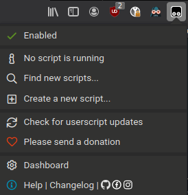

3. Install the script from [here](https://github.com/mkey/CorbettReportUIEnhancer/raw/main/script/CR-UI-Enhancer.user.js). You will see something similar to below, click the `Install` or `Reinstall` button.

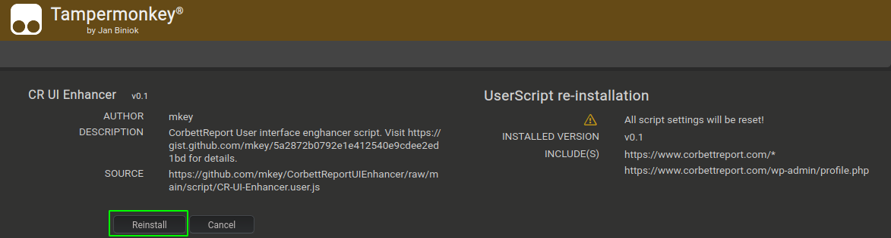

4. Once the script is installed, proceed to [corbettreport.com](https://www.corbettreport.com/), login into the site and then go to your profile page (on the top right, where it states `Howdy, [username]` or simply click [here](https://www.corbettreport.com/wp-admin/profile.php).

5. On the bottom of the profile settings, you will see a new section that can be used to configure the [CorbettReport UI Enhancer Script](). **CHANGES IN V0.2**

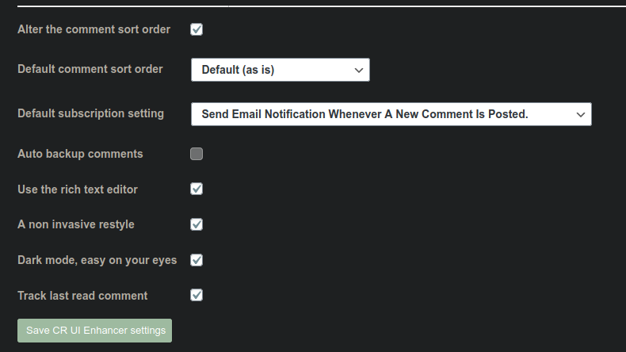

##### There are 5 settings:
- `Alter the comment sort order` - true or false, allows you to completely turn off the comment sort order functionality.
- `Default comment sort order` - works in conjunction with above, if `Alter the comment sort order` is turned on, then this setting will allow to choose the **default** comment sort order.
- `Default subscription setting` - The email subscription setting default.
- `Auto backup comments` - just a placeholder for the time being, work in progress
- `Use the rich text editor` - true or false, allow the use of the inbuilt rich text editor that replaces the basic text input box
- `A non invasive restyle` - **NEW IN V0.2** true or false, offers a mild graphical redesign of the site
- `Dark mode, easy on your eyes` - **NEW IN V0.2** true or false, offers a dark mode resking for the site (still WIP, there will be some bits here and there that need to be corrected)
- `Track last read comment` - **NEW IN V0.2** true or false, keeps ***track*** of the last *read* comment per article.

**DISCLAIMER** all the *tracking* that is going on here consists of storing the last *read* comment ID in the browser's local storage. The script creator nor any other living or non living entity shall not be notified by means of [CorbettReport UI Enhancer Script]() of any actions undertaken by the [corbettreport.com](https://www.corbettreport.com/) intergalactic visitors. Not about what was read or was not read or anything in between.

The key word in *open source code* that is available [here](https://github.com/mkey/CorbettReportUIEnhancer/raw/main/script/CR-UI-Enhancer.user.js) is ***open***.

##### Comment sort order setting:
- `Default (as is)` - does not change anything
- `Chronological descending` - sorts comments chronologically, newest on top
- `Chronological ascending` - sorts comments chronologically, oldest on top
- `Own comment threads only` - only filters threads you have started or in which you have replied, by following the default comment layout

6. Once you get to the comments section of [corbettreport.com](https://www.corbettreport.com/) you will begin to notice some changes. **CHANGES IN V0.2** (see step 10 below)

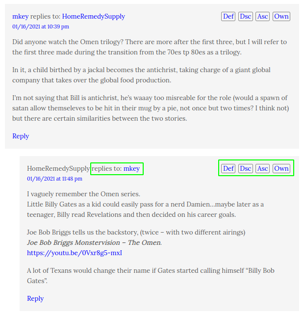

- a small toolbar pops up on in the comments right-hand side top corner. **CHANGES IN V0.2** (see step 10 below, buttons have been moved to the toolbar on the top of the page.) The four buttons do what is already explained in the above section `Comment sort order setting`. That is, clicking the button sorts the comments in the defined manner.
- a hyperlink will show up, linking to a comment the given comment is written in reply to. In the default layout this is less useful, but becomes increasingly relevant with the chronological sort order, as shown by the following example.

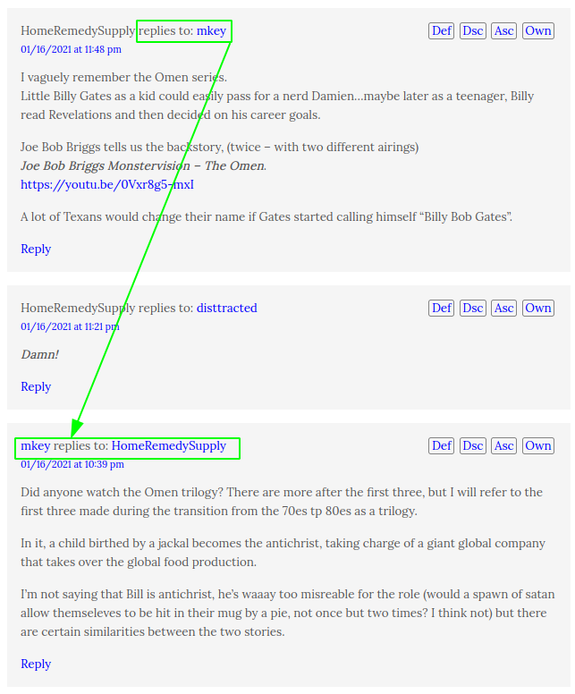

7. The rich text input box.

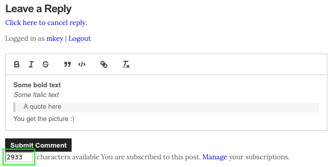

##### There are several buttons on the toolbar

- `B` - bolds text, keyboard shortcut CTRL+B
- `I` - emphasises text, keyboard shortcut CTRL+I
- `S` - text strikethrough
- `"` - quote text selection
- `</>` - code text formatting
- `URL` - a URL input box (for the time being, it's a bit inconveniently placed)
- `T` - clears all text formatting

An added benefit is that the character counter (bottom left) is now *working* and is counting characters used. Once this count dries up, the counter will turn red and while you won't be prevented from submitting, your comment will probably be sent to the moderation que and snipped. But at least you are made aware of the wordiness of your comment.

**Note** - when you paste text from an outside source, this box will by default accept all rich text formatting from the source (including URLs etc.) while the comment text will be sanitized during submission and all unsupported formatting will be stripped. To paste just **plain text** and strip formatting, use `CTRL+SHIFT+V` on your keyboard. For example, by pressing `CTRL+V` I get this:

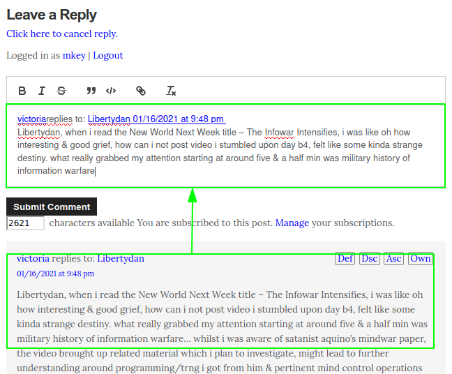

By pressing `CTRL+SHIFT+V` I get this:

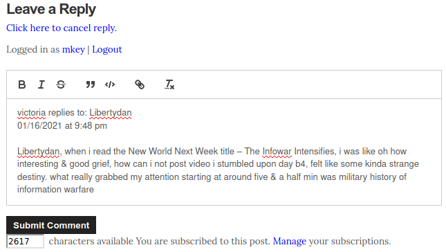

**Note 2** - formatting can get a bit messy sometimes (just a tradeof when using fancier controls) and when in doubt, simply select the whole comment text and click the text formatting clear button (the last button on the toolbar).

8. *NEW IN V0.2* everyone's favorite website at [corbettreport.com](https://www.corbettreport.com/) has now been reskined a bit in a very friendly fashion without implying anything about the current site look or feel. Example screenshot in the next step.

9. *NEW IN V0.2* everyone's favorite website (echo?) at [corbettreport.com](https://www.corbettreport.com/) has now been bestowed with a dark mode. Because tired eyes.

Here are the two new layouts combined. This would also be the recommended way to use these two options because I haven't tested them separately. At all :P But I like having options, so there it goes. *You are welcome* says I when your eyes say *thank you*.

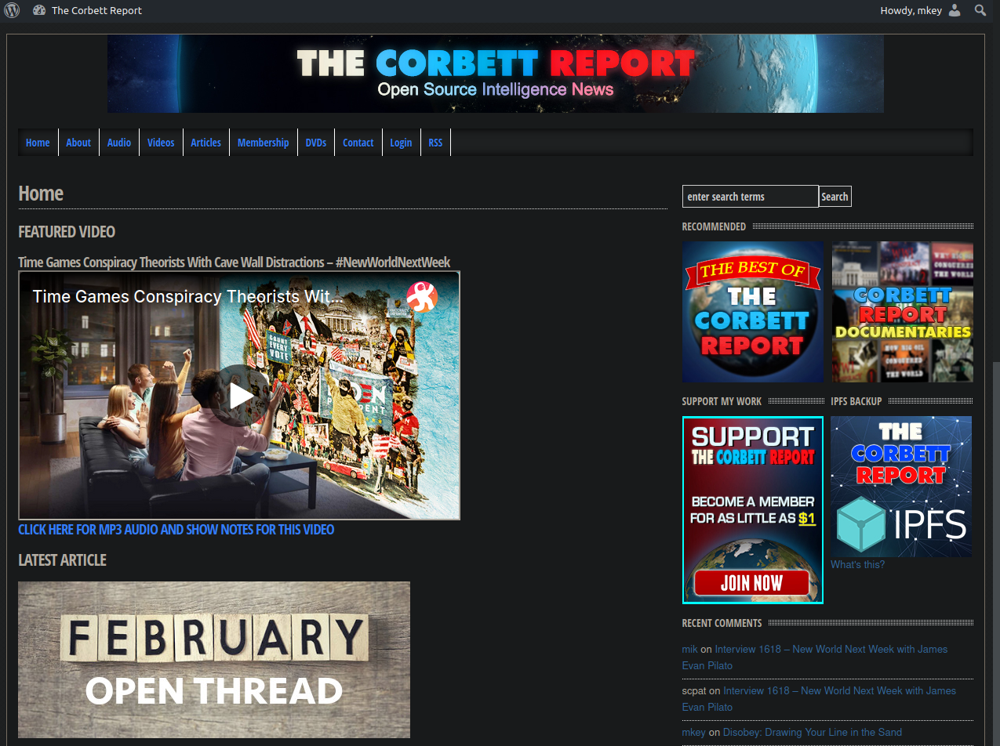

10. *NEW IN V0.2* a new feature is the *unread* comments button. By pressing the `Next` button, the page will magically scroll to the least *read* comment. The script does not, of course, know what one has read, but it just keeps ***track*** (as per disclaimer above) of the last comment that was loaded when an article has been accessed. By reloading the page, the script will rightly assume every comment has been read and will mark them as such.

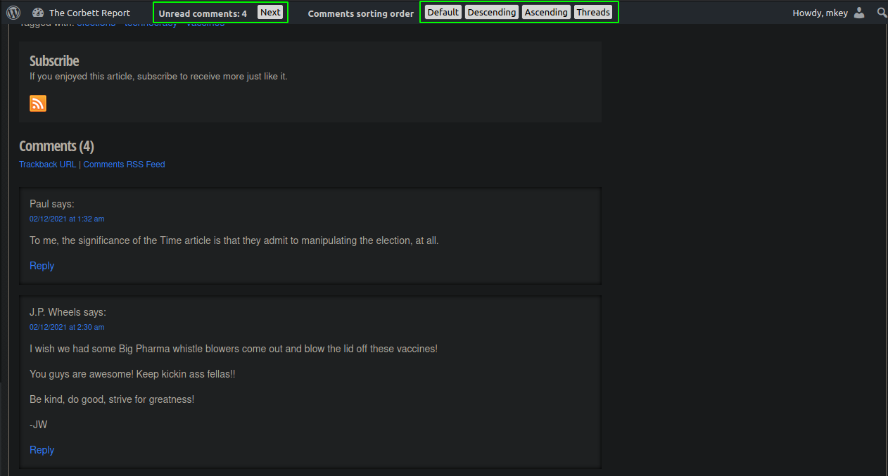

**Note** - comment sort order buttons have now been moved to the toolbar on the top of the page.

11. *NEW IN V0.2* the script should from this point onward automatically offer updates, from time to time, depending on Tampermonkey settings.

12. **NEW IN V0.3** this is more akin to a bug fix, the comment edit box now also uses the rich text control.

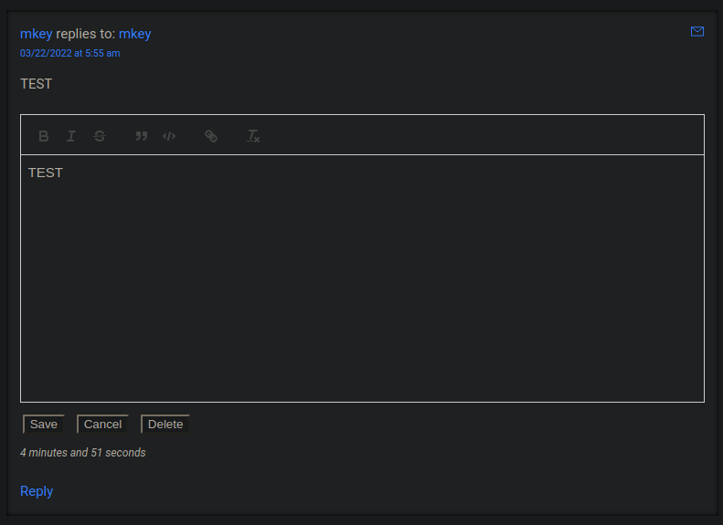

13. **NEW IN V0.3** on the top of the page, to the (far?) right of the article title, now there will be a clickable IPFS URL for the same article.

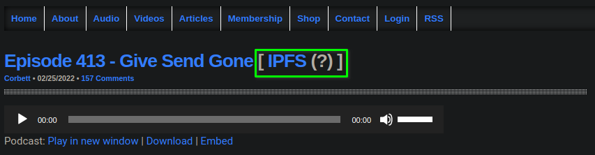

**Note** - This URL might not exist, we are merely guessing that it exists. Thus the question mark. The URL will, in fact, be valid once the IPFS mirror of [corbettreport.com](https://www.corbettreport.com/) is updated.

14. **NEW IN V0.3** an option to share comments from the [corbettreport.com](https://www.corbettreport.com/) comments section via email has been made available. Upon clicking the button an eml file will be created (some browsers might declare this file to be *unsafe*, use your judgement) and offered for download. This file will open in many email clients as a new email that is ready to be sent toward unsuspecting recipients.

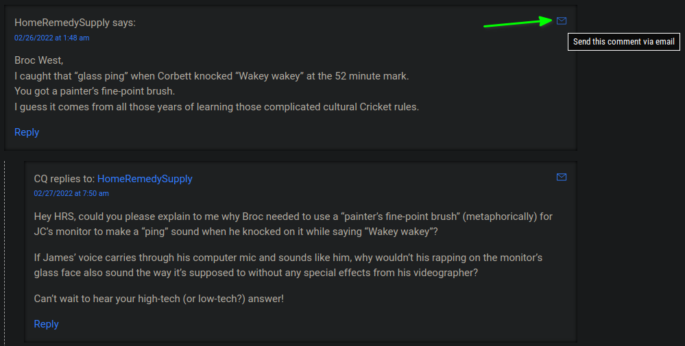

15. **NEW IN V0.3** a site search button has been added to the search box in the top right of the page. The **Search** button searches the site the usual way, while the **Site search** button will search the site in the provided external search engine. This search will include results from the [corbettreport.com](https://www.corbettreport.com/) comments section.

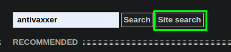

I have provided by default [https://metager.org](https://metager.org) as the external search engine as this is what I'm using currently. If you wish to use something else, I propose editing the script directly as follows:

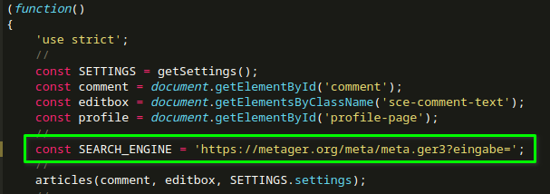

In the future I might provide search engine optins, but for the time being I found that to be outside of the scope of this excercise.

**Note** the newsletter comments section will probably be off limits for web crawlers as those are the only articles that are behind a paywall of sorts.

16. **NEW IN V0.3** various styling fixes and minor changes/improvements.
