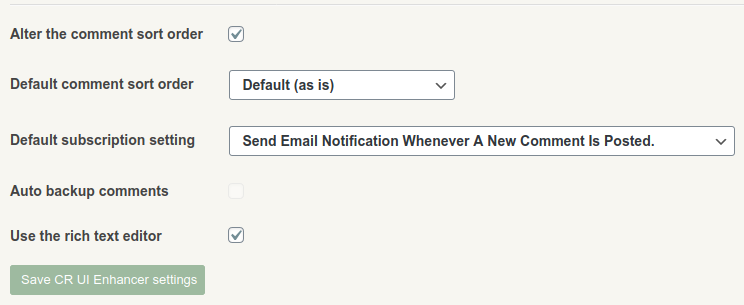

### CorbettReport UI Enhancer Script

This user script is written to help enhance the user's experience on the site [corbettreport.com](https://www.corbettreport.com/). Follow these simple steps to install and learn how to configure and use the script.

#### Credits

- Quill rich text editor used under the hood [quilljs.com](https://quilljs.com/)
- [James Corbett](https://infogalactic.com/info/James_Corbett_(journalist)) for [corbettreport.com](https://www.corbettreport.com/).

#### How to install

If you already have a userscript browser addon installed, skip to step 3:

1. Install the `Tampermonkey` browser extension  - [Chrome](https://chrome.google.com/webstore/detail/tampermonkey/dhdgffkkebhmkfjojejmpbldmpobfkfo?hl=en) - [Firefox](https://addons.mozilla.org/en-US/firefox/addon/tampermonkey/) (you will be prompted by the browser to confirm the installation, confirm when ready).
2. Familiarize yourself with this addon's simple menu by clicking the addon icon (by default on the top right of the browser window).

3. Install the script from [here](https://github.com/mkey/CorbettReportUIEnhancer/raw/main/script/CR-UI-Enhancer.user.js). You will see something similar to below, click the `Install` or `Reinstall` button.

4. Once the script is installed, proceed to [corbettreport.com](https://www.corbettreport.com/), login into the site and then go to your profile page (on the top right, where it states `Howdy, [username]` or simply click [here](https://www.corbettreport.com/wp-admin/profile.php).

5. On the bottom of the profile settings, you will see a new section that can be used to configure the [CorbettReport UI Enhancer Script]().

##### There are 5 settings:
- `Alter the comment sort order` - true or false, allows you to completely turn off the comment sort order functionality.
- `Default comment sort order` - works in conjunction with above, if `Alter the comment sort order` is turned on, then this setting will allow to choose the **default** comment sort order.
- `Default subscription setting` - The email subscription setting default.
- `Auto backup comments` - just a placeholder for the time being, work in progress
- `Use the rich text editor` - true or false, allow the use of the inbuilt rich text editor that replaces the basic text input box

##### Comment sort order setting:
- `Default (as is)` - does not change anything
- `Chronological descending` - sorts comments chronologically, newest on top
- `Chronological ascending` - sorts comments chronologically, oldest on top
- `Own comment threads only` - only filters threads you have started or in which you have replied, by following the default comment layout

6. Once you get to the comments section of [corbettreport.com](https://www.corbettreport.com/) you will begin to notice some changes.

- a small toolbar pops up on in the comments right-hand side top corner. The four buttons do what that is already explined in the above section "Comment sort order setting". That is, clicking the button sorts the comments in the defined manner.
- a hyperlink to a comment the given comment is written in reply to will show up. In the default layout this is not very usefull at all, but becomes relevant with the chronological sort order, as shown by the following example.

7. The final improvement (for the time being, at least) is the rich text input box.

##### There are several buttons on the toolbar

- `B` - bolds text, keyboard shortcut CTRL+B
- `I` - emphasises text, keyboard shortcut CTRL+I
- `S` - text strikethrough
- `"` - quote text selection
- `</>` - code text formatting
- `URL` - a URL input box (for the time being, it's a bit inconveniently placed)
- `T` - clears all text formatting

And added benefit is that the character counter (bottom left) is now working and is counting characters used. Once this count dries up, the counter will turn red and while you won't be prevented from submitting, your comment will probably be sent to the moderation que and snipped.

**Note** - when you paste text from an outside source, this box will by default accept all rich text formatting from the source (including URLs etc.) while the comment text will be sanitized during submission and all unsupported formatting will be stripped. To paste just **plain text** and strip formatting, use CTRL+SHIFT+V on your keyboard. For example, by pressing CTRL+V I get this:

By pressing CTRL+SHIFT+V I get this:

**Note 2** - formatting can get a bit messy sometimes (just a tradeof when using fancier controls) and when in doubt, simply select the whole comment text and click the text formatting clear button (the last button on the toolbar).
